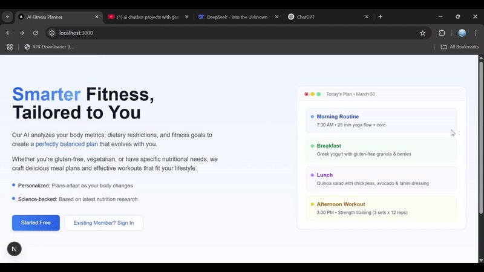

# 🏋️‍♂️ **Ai Fitness Planner** 🍎

Welcome to **My Fitness App**! 🎉 This is a **full-stack AI-powered diet and workout planner** designed to provide **personalized meal plans and fitness routines** based on user health data, fitness goals, and dietary preferences. 🚀

---



## 🔧 **Technologies Used**

- **Frontend**: Next.js 15 ⚛️ + Tailwind CSS 🎨  
- **Backend**: Next.js ⚙️  
- **Database**: MongoDB 🍃  
- **AI Integration**: GoogleGenerativeAI 🤖   

---

## 🛠️ **Features**

### **User Side** 👥  
- **User Signup & Login** 🔑  
- **Personalized Meal & Workout Plans** 🍽️💪  
- **AI-powered Recommendations** 🧠    

---

## ⚡ **Setup Instructions**

### **Prerequisites**  
- Next.js ✅  
- MongoDB ✅  

---

### 🏠 **Installation**

1. **Clone the repository**:  
   ```bash
   git clone <repository-url>
   cd my-fitness-app
   ```

2. **Set up for the project**:  
   - Navigate to the folder:  
     ```bash
     cd Ai_Fitness_Planner
     ```
   - Install dependencies:  
     ```bash
     npm install
     ```
   - Set your .env file:  
     ```bash
     MONGODB_URI = Your Url
     NEXTAUTH_SECRET = Your Secret Code
     NEXTAUTH_URL = Website Local Host Url
     NEXT_PUBLIC_GOOGLE_API_KEY = Your Gemini Api Key
     GOOGLE_API_KEY = Your Gemini Api Key
     ```
3. **Run your Project**:  
   ```bash
   npm run dev
   ```

---

## 🔮 **Future Improvements**  
- **Advanced AI Model** 🤖: Improve fitness & nutrition predictions.  
- **Wearable Device Integration** ⌚: Sync data from smartwatches.  
- **Community Support System** 👫: Add a forum for user discussions.  

---

## 💡 **Notes**  
This project is built for **learning purposes** and is an **individual project** aimed at gaining expertise in **full-stack AI-integrated development**. 🚀
